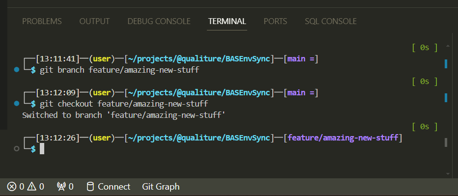
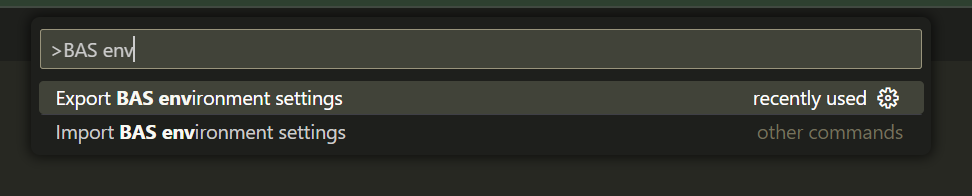
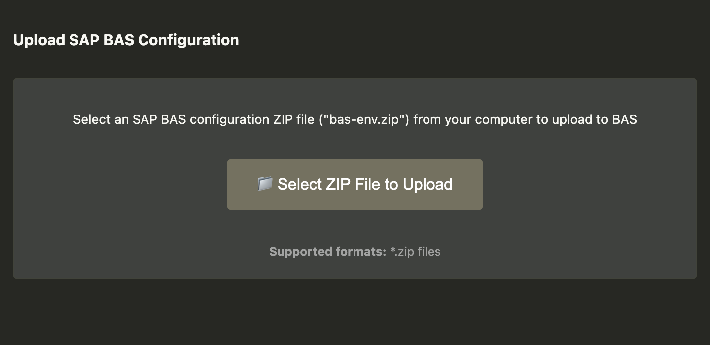

[![Contributors][contributors-shield]][contributors-url]
[![Forks][forks-shield]][forks-url]
[![Stargazers][stars-shield]][stars-url]
[![Issues][issues-shield]][issues-url]
[![MIT License][license-shield]][license-url]
[![LinkedIn][linkedin-shield]][linkedin-url]

# BASEnvSync (extension for SAP BAS / SAP Build Code)

|  |
|----|
| *Transfer configuration files from one BAS workspace to another BAS workspace. Image was created with AI.* |

## About The Project

**TL;DR: Exports and imports SAP Business Application Studio environment settings**

If you're a developer working with **[SAP Business Application Studio ("BAS")](https://www.sap.com/products/technology-platform/business-application-studio.html)**, chances are you are using its terminal a lot. Having worked with Linux, OS X and macOS for decades, I developed a habit of tweaking the terminal shell to my taste. Carefully crafted, heavily customized Bash prompts displaying Git branch status, execution times, autocomplete, command history, custom aliases, etc:

> 
> *Imagine recreating prompts like this manually every time you create a new Dev Space...*

If all this resonates with you, then this VSCode extension might just be for you as well.

Many years ago, when working in multiple **SAP Business Application Studio** developer spaces simultaneously, I had quite the struggle to make sure all my spaces more or less had the same developer experience / look and feel. 

Not only terminal settings, but also global gitignore settings, git credentials, everything had to be set up again, which, as you probably have experienced yourself, was *extremely* time-consuming... Not to mention the "standard" BAS / VSCode settings, color scheme, keymaps, etc.

To mitigate that, I wrote a small shell script which allowed me to transfer these settings and configurations from one Dev Space to another, and in addition it transfered BAS' `settings.json`, `keymap.json` and an overview of any additional VSCode extensions you may have installed (see [this deprecated repo](https://github.com/qualiture/sync-bas-env)).

However, one day that script failed to work properly. It turned out, after an update of the underlying platform of BAS -- Eclipse Theia -- it no longer stored the `settings.json` file directly on the file system anymore. Instead, it is now stored somewhere inside the user profile, and I was not able to easily access it anymore.

**Luckily, BAS now lets you export / import your profile which contains all the user settings, *and* the installed extensions!**

Nevertheless, I still needed to find a way to tranfer other Dev Space settings, such as `.bashrc`, `.bash_aliases`, git settings, et al.

This VSCode extension lets you export your environment settings from one Dev Space, and lets you import those settings in another Dev Space.

## How It Works

 - First, you need to install the BASEnvSync VSCode extension.

 - After installation, you have two new options in the BAS Command Palette:

    

 - Because the exporting of the BAS profile (see next part) includes all the installed extensions, *there is no need to reinstall the extension on the new Dev Space*! Simply run the import and off you go!

The next part will outline how to export and import your profile and settings.

### 1) Exporting / importing BAS profile

Because this script **does not** export the BAS' `settings.json` file, you must export / import your BAS profile first:

**From the source Dev Space:**

- Click the "cogwheel" icon in the lower left, and select *Profiles* > *Export Profile...*
- Follow the steps to export your BAS profile, and save it to your local harddisk.
  Just make sure the `BASEnvSync` extension is included in the profile export 😎

**From the target Dev Space:**

- Drag the downloaded `<profile-name>.code-profile` file into the Explorer.
- Click the "cogwheel" icon in the lower left, and select *Profiles* > *Import Profile...*
- Follow the steps to import your BAS profile, and reload BAS

### 2) Exporting settings from source Dev Space

- Open the Command Palette, and execute **Export BAS environment settings**

- A file `bas-env.zip` will be created which you then download to your local harddisk.

    This ZIP file will contain -- if available in your Dev Space -- the following items:

    - `~/.bashrc`
    - `~/.bash_aliases`
    - `~/.profile`
    - `~/.npmrc`
    - `~/.gitignore`
    - `~/.gitconfig`
    - `~/.git-credentials`
    - `~/.inputrc`
    - `~/.scripts` (folder)

    > NB: In most cases, you will notice the `~/.scripts` folder is skipped; I created that folder containing some shell scripts to enhance Bash (history, autocomplete, etc)

### Importing settings to target Dev Space

- Open the Command Palette, and execute **Import BAS environment settings**

- After 1-2 seconds, a new tab will open which allows you to upload the `bas-env.zip` file (the file you have downloaded earlier) by clicking the **Select ZIP file to Upload** button:

    

- When the initial upload of the `bas-env.zip` file was successful, click the **Transfer configuration to BAS** button:

    

- After the settings have been loaded, open a new terminal and examine the applied changes.

## Roadmap

- Proper error handling
- Instead of a hard-coded list of files and folders to export, provide possibility of making this more flexible (config file? commandline arguments?)

## Known issues

See the [open issues](https://github.com/qualiture/BASEnvSync/issues) for a list of known issues (and proposed features).

If you have any suggestions of bugs, please let me know. I might even find the time to fix / implement 😎

## Contributing

Contributions are what make the open source community such an amazing place to be learn, inspire, and create. Any contributions you make are **greatly appreciated**.

1. Fork the Project
2. Create your Feature Branch (`git checkout -b feature/AmazingFeature`)
3. Commit your Changes (`git commit -m 'Add some AmazingFeature'`)
4. Push to the Branch (`git push origin feature/AmazingFeature`)
5. Open a Pull Request

## Contact

Robin van het Hof - [@qualiture](https://twitter.com/qualiture)

<!-- MARKDOWN LINKS & IMAGES -->
<!-- https://www.markdownguide.org/basic-syntax/#reference-style-links -->
[contributors-shield]: https://img.shields.io/github/contributors/qualiture/BASEnvSync.svg?style=flat-square
[contributors-url]: https://github.com/qualiture/BASEnvSync/graphs/contributors
[forks-shield]: https://img.shields.io/github/forks/qualiture/BASEnvSync.svg?style=flat-square
[forks-url]: https://github.com/qualiture/BASEnvSync/network/members
[stars-shield]: https://img.shields.io/github/stars/qualiture/BASEnvSync.svg?style=flat-square
[stars-url]: https://github.com/qualiture/BASEnvSync/stargazers
[issues-shield]: https://img.shields.io/github/issues/qualiture/BASEnvSync.svg?style=flat-square
[issues-url]: https://github.com/qualiture/BASEnvSync/issues
[license-shield]: https://img.shields.io/github/license/qualiture/BASEnvSync.svg?style=flat-square
[license-url]: https://github.com/qualiture/BASEnvSync/blob/master/LICENSE
[linkedin-shield]: https://img.shields.io/badge/-LinkedIn-black.svg?style=flat-square&logo=linkedin&colorB=555
[linkedin-url]: https://linkedin.com/in/robinvanhethof

[product-screenshot]: https://blogs.sap.com/wp-content/uploads/2020/07/2020-06-AppStudio-on-SCP.png
